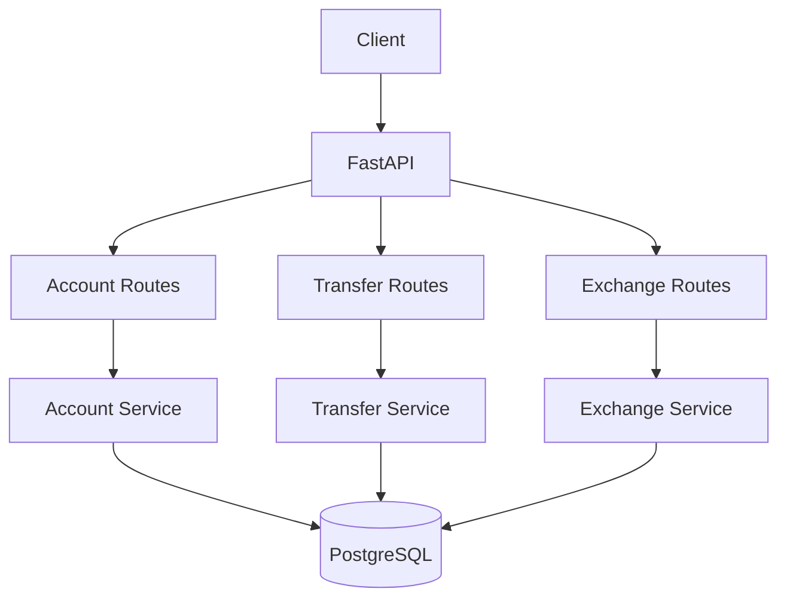

# PayFlow 💸
A production-grade fintech payment API built with FastAPI, SQLAlchemy, and PostgreSQL. Features ACID-compliant transfers, currency exchange, idempotent transactions, and comprehensive test coverage.

Built as a portfolio project demonstrating backend engineering skills for fintech applications.

## Features
- ✅ Account management with multi-currency support (USD, EUR, GBP, INR, JPY, AUD, CAD, CHF)
- ✅ ACID-compliant money transfers with pessimistic locking
- ✅ Currency exchange with configurable rates
- ✅ Idempotent transactions (safe retry with idempotency keys)
- ✅ Deadlock prevention (consistent lock ordering)
- ✅ Comprehensive test suite with concurrency tests
- ✅ Docker Compose for one-command deployment
- ✅ CI/CD with GitHub Actions

## Tech Stack
| Layer | Technology |
|---|---|
| Framework | FastAPI |
| ORM | SQLAlchemy 2.0 |
| Database | PostgreSQL 16 |
| Validation | Pydantic v2 |
| Testing | pytest + httpx |
| Containerization | Docker + Docker Compose |
| CI/CD | GitHub Actions |

## Quick Start

### With Docker (Recommended)
```bash
git clone https://github.com/ShivanshHingve2804/PayFlow.git
cd PayFlow
docker compose up --build
# API available at http://localhost:8000
# Docs at http://localhost:8000/docs
```

### Local Development
```bash
python -m venv .venv
source .venv/bin/activate  # or .venv\Scripts\activate on Windows
pip install -e '.[dev]'
# Set up PostgreSQL or use SQLite for development
export DATABASE_URL=sqlite:///./payflow.db
uvicorn app.main:app --reload
```

### Run Tests
```bash
pytest -v --tb=short
pytest --cov=app --cov-report=term-missing  # with coverage
```

## Architecture



## API Endpoints

| Method | Endpoint | Description |
|---|---|---|
| POST | /api/v1/accounts/ | Create a new account |
| GET | /api/v1/accounts/{id} | Get account details |
| GET | /api/v1/accounts/{id}/balance | Get account balance |
| POST | /api/v1/accounts/{id}/deposit | Deposit funds |
| POST | /api/v1/transfers/ | Transfer between accounts |
| GET | /api/v1/transfers/{id} | Get transfer details |
| POST | /api/v1/exchange/ | Currency exchange |
| GET | /api/v1/exchange/rates | Get exchange rates |

### Example: Create Account
```bash
curl -X POST http://localhost:8000/api/v1/accounts/ \
  -H 'Content-Type: application/json' \
  -d '{"owner_name": "Alice", "currency": "USD", "initial_balance": 1000}'
```

### Example: Transfer Money
```bash
curl -X POST http://localhost:8000/api/v1/transfers/ \
  -H 'Content-Type: application/json' \
  -d '{"from_account_id": "<alice-id>", "to_account_id": "<bob-id>", "amount": 250.00, "idempotency_key": "txn-001"}'
```

## Design Decisions

### Why Pessimistic Locking?
In financial systems, data consistency is non-negotiable. We use SELECT ... FOR UPDATE to prevent race conditions during concurrent balance modifications. Accounts are locked in sorted ID order to prevent deadlocks.

### Why Idempotency Keys?
Network failures happen. Idempotency keys ensure that retrying a failed request doesn't result in duplicate transactions — critical for payment systems.

### Why String UUIDs?
Using String(36) for UUID columns ensures full portability between PostgreSQL (production) and SQLite (testing) without dialect-specific code.

## Testing
The test suite includes:
- **Unit tests**: Account CRUD, validation, error handling
- **Integration tests**: End-to-end transfer and exchange flows
- **Concurrency tests**: Balance consistency under rapid sequential operations
- **Idempotency tests**: Duplicate request handling

Total: 35+ test cases

## License
MIT

## Author
**Shivansh Hingve** — [GitHub](https://github.com/ShivanshHingve2804) | [LinkedIn](https://linkedin.com/in/shivansh-hingve-6a18a7258)
